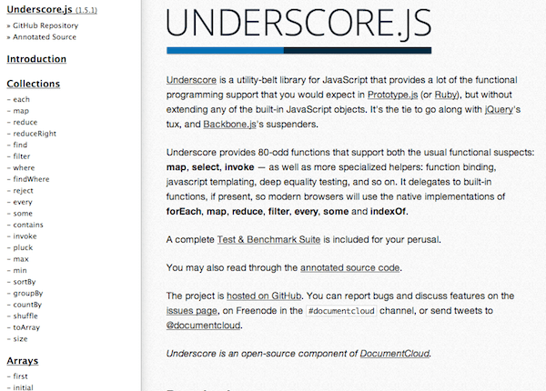
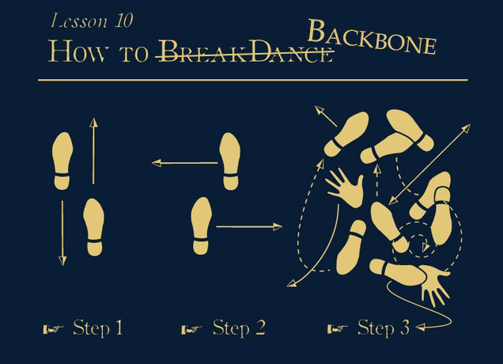
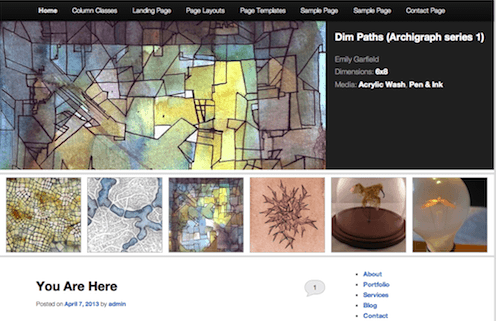
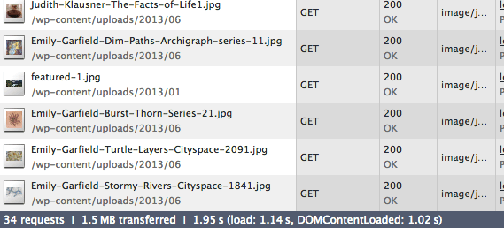
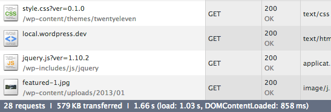
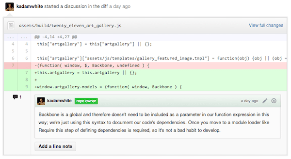
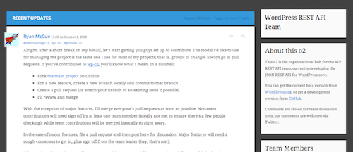
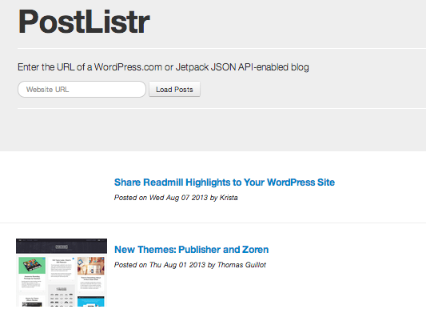

# Evolving your JavaScript with Backbone.js

WordCamp Boston, October 2013

K.Adam White &bull; [@kadamwhite](https://twitter.com/kadamwhite)

Engineer at [Bocoup](http://bocoup.com/)


*At any time, hit "escape" to get an overview of all slides. This is a two-dimensional slide deck; Many slides have code examples available if you press "down."*


<small>(I've got stickers, if you're into that sort of thing)</small>


# 


[BostonWP](http://www.bostonwp.org) Co-Organizer


## So. Who Are You Folks?


## WordPress & JavaScript


## JavaScript drives the
# Most Visible
## new features in WP


## 3.3: Distraction-Free Writing
## 3.4: Theme Customizer
## 3.5: Media Manager
## 3.6: Revisions


> “[3.5] signifies a shift from PHP land to JavaScript land for pretty much everything we’re going to do in the future”
>
> <small>~ WP 3.5 Lead Developer Andrew Nacin, [on WPCandy, Feb 4 2013](http://wpcandy.com/reports/a-shift-from-php-land-to-javascript-land/)</small>


## JS Needs within WordPress
## Have Changed


## WordPress 3.5
# Media
## re-write


***&nbsp;&nbsp;&nbsp;Beyond***


## What Is Underscore?

> Underscore is a **utility-belt library** for JavaScript that provides functional programming support without extending any of the built-in JavaScript objects.
>
> <small>*~ Adapted from [underscorejs.org](http://underscorejs.org)*</small>


## `_` is One Fine Utility Belt:

```markdown
        Collections            Arrays               Functions
        
        - each                 - first              - bind
        - map                  - initial            - bindAll
        - reduce               - last               - partial
        - reduceRight          - rest               - memoize
        - find                 - compact            - delay
        - filter               - flatten            - defer
        - where                - without            - throttle
        - findWhere            - union              - debounce
        - reject               - intersection       - once
        - every                - difference         - after
        - some                 - uniq               - wrap
        - contains             - zip                - compose
        - invoke               - object
        - pluck                - indexOf            Objects
        - max                  - lastIndexOf
        - min                  - sortedIndex        - keys
        - sortBy               - range              - values
        - groupBy                                   - pairs
        - indexBy              Utility              - invert
        - countBy                                   - functions
        - shuffle              - noConflict         - extend
        - sample               - identity           - pick
        - toArray              - times              - omit
        - size                 - random             - defaults
                               - mixin              - clone
        Chaining               - uniqueId           - tap
                               - escape             - has
        - chain                - unescape           - isEqual
        - value                - result             - isEmpty
                               - template           - isElement
                                                    - isArray
                                                    - isObject
                                                    - isArguments
                                                    - isFunction
                                                    - isString
                                                    - isNumber
                                                    - isFinite
                                                    - isBoolean
                                                    - isDate
                                                    - isRegExp
                                                    - isNaN
                                                    - isNull
                                                    - isUndefined
```




**More at [Underscorejs.org](http://underscorejs.org/#objects)**


* Do things to groups of data
* Functional programming in JS
* General utilities


## Underscore is the
## backbone of Backbone.js


## What is Backbone?

> Backbone.js gives structure to web applications by providing **models** with key-value binding and custom events, **collections** [to group and manipulate those models], **views** with declarative event handling...
>
> <small>*~ Adapted from [backbonejs.org](http://backbonejs.org); emphasis added*</small>


## Separate Rendering from Logic

**Models** hold your data

**Views** render it on the page & handle user input


## Models

```javascript
var MyModelConstructor = Backbone.Model.extend({});

var modelInstance = new MyModelConstructor({
  prop1: 'some data',
  prop2: 'you want to store in a structured way'
});

console.log( modelInstance.get('prop1') ); // 'some data'
```


## Views

```javascript
var MyViewConstructor = Backbone.View.extend({
  el: '.my-view-container',
  render: function() {
    this.$el.html(
      this.model.get('prop1') + ' ' + this.model.get('prop2')
    );
    return this;
  }
});
var viewInstance = new MyViewConstructor({ model: modelInstance });
viewInstance.render();
// .my-view-container displays "some data that you want to
//                              store in a structured way"
```
Take that data, give it form


## That's a lot of boilerplate...

If you're used to "plain ol' JavaScript",
```javascript
var myData = {
  prop1: 'some data',
  prop2: 'you want to store in a *less* structured way'
};

$('.my-view-container').html( myData.prop1 + ' ' + myData.prop2 );
```
Backbone's *definitely* "more code"


# It's Worth It


## jQuery can't (as easily) do this:
```javascript
var MyViewConstructor = Backbone.View.extend({
  render: function() { /* ... */ },
  initialize: function() {
    // Re-render whenever the model changes!
    this.listenTo( this.model, 'change', this.render );
  }
});

// Other code...

modelInstance.set({
  'prop1': 'some NEW data'
});

// View now reads
// "some NEW data that you want to store in a structured way"
```
Your views can listen for changes in models,<br />
and automatically update themselves


## A little More Work Up Front
## ===
## Less Work Down the Road

The more structured your code is,

the easier it is to fix or modify


But I know
## Basic jQuery

```javascript
$('a.toggler').on('click', function() {
  $('.toggleable-thing').toggle();
});
```


and I thought Backbone was just for
## Complex Web Apps?





# It's Easy

We're going to take a small theme feature

and re-factor it to be awesome


## Homepage Image Gallery




[Gallery Code](https://github.com/kadamwhite/backbone-wordpress-demo/pull/7)


### Mostly PHP
```php
<?php
if ( is_front_page() ) :
  $args = array(
    'post_type' => 'ag_artwork_item',
    'posts_per_page' => 6
  );
  $artwork_items = new WP_Query($args);

  if($artwork_items->have_posts()) :
?>
<div class="artwork-header-gallery">
  <?php
    while( $artwork_items->have_posts() ) : $artwork_items->the_post();
      $permalink_title = esc_attr( sprintf( __( 'Permalink to %s', 'artwork' ), the_title_attribute( 'echo=0' ) ) );
  ?>
  <div class="artwork-featured" style="display: none;">
    <a class="artwork-image"
       href="<?php the_permalink(); ?>"
       title="<?php echo $permalink_title; ?>"
       rel="bookmark">
      <?php the_post_thumbnail( 'large' ); ?>
    </a>
    <div class="artwork-information">
      <h3>
        <a href="<?php the_permalink(); ?>"
           title="<?php echo $permalink_title; ?>"
           rel="bookmark">
          <?php the_title(); ?>
        </a>
      </h3>
      <?php
        // Using `get_the_content` to opt out of the post type plugin's custom formatting in `the_content` filter
        echo wpautop( get_the_content() );

        // Get taxonomies
        $dimensions = get_the_term_list(
          $post->ID,
          'ag_artwork_dimensions',
          'Dimensions: ',
          ', ',
          ''
        );

        $media = get_the_term_list(
          $post->ID,
          'ag_artwork_media',
          'Media: ',
          ', ',
          ''
        );
      ?>
      <div class="entry-meta">
        <p><?php the_author(); ?></p>
        <p><?php echo $dimensions; ?></p>
        <p><?php echo $media; ?></p>
      </div> <!-- .entry-meta -->
    </div> <!-- .artwork-information -->
  </div> <!-- .artwork-featured -->
  <?php endwhile; ?>
  <div class="artwork-thumbnails">
    <?php
      rewind_posts(); // Second verse, same as the first
      while( $artwork_items->have_posts() ) : $artwork_items->the_post();
        // (Render the trigger links and images for each thumbnail)
    ?>

    <a href="<?php the_permalink(); ?>"
       title="<?php echo esc_attr(sprintf( __( '%s', 'artwork' ), the_title_attribute( 'echo=0' ) ) ); ?>">
      <?php the_post_thumbnail( 'thumbnail' ); ?>
    </a>

    <?php endwhile; ?>
  </div> <!-- .artwork-thumbnails -->
  <?php endif; // have_posts() ?>
</div> <!-- .artwork-header-gallery -->
<?php endif; // is_front_page() ?>
```


### Not much JS:

```javascript
  $(document).ready(function() {
    var $headerGallery, $thumbnails, $featuredArtwork;

    $headerGallery = $('.artwork-header-gallery');
    $thumbnails = $headerGallery.find('.artwork-thumbnails');
    $featuredArtwork = $headerGallery.find('.artwork-featured');

    // Catch any clicks on the image thumbnails
    $thumbnails.on('click', 'a', function( evt ) {
      var index, $selectedItem, $visibleItems;

      evt.preventDefault();

      // If we clicked the same image that's showing, do nothing
      if ( $visibleItems.index() === index ) {
        return;
      }

      if ( $visibleItems.length ) {
        $featuredArtwork.filter(':visible').hide();
        $featuredArtwork.eq( $(this).index() ).show();
      } else {
        $('#branding').children('a').slideUp();
        $selectedItem.slideDown();
      }
    });
  });
```


Basically,

## Render Everything,

### Hide & Show as needed


### Verdict:



### This feature Needs Improvement


# Step 1

Get the hidden Div's out of that DOM


[Code for Step 1](https://github.com/kadamwhite/backbone-wordpress-demo/pull/8)


### Loop once, just render thumbnails
```php
<?php
if ( is_front_page() ) :
  $args = array(
    'post_type' => 'ag_artwork_item',
    'posts_per_page' => 6
  );
  $artwork_items = new WP_Query($args);

  if($artwork_items->have_posts()) :
?>
<div class="artwork-header-gallery">
  <div class="artwork-featured" style="display: none;"></div>
  <div class="artwork-thumbnails">

    <a href="<?php the_permalink(); ?>"
       data-title="<?php the_title_attribute(); ?>"
       data-artist="<?php the_author(); ?>"
       data-id="<?php echo $post->ID; ?>"
       data-image="<?php echo esc_attr( $image ); ?>"
       data-content="<?php echo esc_attr( wpautop( get_the_content() ) ); ?>"
       data-dimensions="<?php echo esc_attr( $dimensions ); ?>"
       data-permalink="<?php echo esc_attr( $permalink_title ); ?>"
       data-url="<?php echo the_permalink(); ?>"
       data-media="<?php echo esc_attr( $media ); ?>"
       title="<?php echo esc_attr(sprintf( __( '%s', 'artwork' ), the_title_attribute( 'echo=0' ) ) ); ?>">
      <?php the_post_thumbnail( 'thumbnail' ); ?>
    </a>

    <?php endwhile; ?>
  </div> <!-- .artwork-thumbnails -->
  <?php endif; // have_posts() ?>
</div> <!-- .artwork-header-gallery -->
```


### Read that in with jQuery
```javascript
    // Get the featured image data from the link we clicked
    data = $( this ).data();

    // If we clicked the same image that's showing, do nothing
    if ( data.id === $featuredArtwork.data('id') ) {
      return;
    }

    // If the gallery is open, just switch the image
    if ( $featuredArtwork.is(':visible') ) {
      $featuredArtwork
        .html( render( data ) )
        // Set the ID so we can do that convenient comparison up above
        .data( 'id', data.id );
    } else {
      // If the gallery is not yet open, slide it open and hide the banner
      $('#branding').children('a').slideUp();
      $featuredArtwork.html( render( data ) ).slideDown();
      $thumbnails.addClass('open'); // For styling only
    }
```


#### Fewer Downloads == Faster Page Load



# Step 2

Get the rendering markup out of jQuery

and into a JavaScript template


[Step 2, Part 1: From jQuery to a Template](https://github.com/kadamwhite/backbone-wordpress-demo/pull/9)

[Step 2, Part 2: Pre-Compile the Template with Grunt](https://github.com/kadamwhite/backbone-wordpress-demo/pull/10)


## Because this isn't maintainable
```javascript
function renderContent( data ) {
    // Concatenate the HTML and the data into a JavaScript string
    return [
      '<a class="artwork-image" href="', data.url, '" title="', data.permalink, '" rel="bookmark">',
        data.image,
      '</a>',
      '<div class="artwork-information">',
        '<h3>',
          '<a href="', data.url, '" title="', data.permalink, '" rel="bookmark">',
            data.title,
          '</a>',
        '</h3>',
        data.content,
        '<div class="entry-meta">',
          '<p>', data.author, '</p>',
          '<p>', data.dimensions, '</p>',
          '<p>', data.media, '</p>',
        '</div>',
      '</div>'
    ].join('');
  };
```


## Aside: JavaScript Templating

`_.template()`


## Markup, the JavaScript Way

Write the template's markup in an easy-to-use, PHP-tag-like syntax, then compile it with `_.template` into something JavaScript interpreters can understand and optimize


```html
<div><%= mainContent %></div>
<a href="<%= link.url %>" title="<%- link.title %>">
  <%= link.text %>
</a>
```
*this* &uparrow; becomes *that* &downarrow;
```javascript
function(obj) {obj || (obj = {}); var __t, __p = '', __e = _.escape;
with (obj) { __p += '<div>' +((__t = ( mainContent )) == null ?
'' : __t) + '</div>\n<a href="' +((__t = ( link.url )) == null ?
'' : __t) + '" title="' +__e( link.title ) +'">\n  ' +
((__t = ( link.text )) == null ? '' : __t) +'\n</a>\n'; }
return __p};
```


Quick warning: If you render templates from PHP,

**use `<# #>` instead of `<% %>` to avoid conflicts**

with PHP's `asp_tags` (~5% of servers)


**MUCH** faster than building DOM nodes with jQuery

*(And easier to read, too!)*


### So we make a template
```html
<a class="artwork-image" href="<%= url %>" title="<%= permalink %>" rel="bookmark">
  <%= image %>
</a>
<div class="artwork-information">
  <h3>
    <a href="<%= url %>" title="<%= permalink %>" rel="bookmark">
      <%= title %>
    </a>
  </h3>
  <% if ( content ) { %><%= content %><% } %>
  <div class="entry-meta">
    <p><%= artist %></p>
    <% if ( dimensions ) { %><p><%= dimensions %></p><% } %>
    <% if ( media ) {      %><p><%= media      %></p><% } %>
  </div>
</div>
```


## and use that to render the markup
```javascript
renderGallery = window.artgallery['assets/js/templates/gallery_featured_image.tmpl'];

// ...

$featuredArtwork.html( renderGallery(data) );
```


# Step 3

Structure our featured image code with Backbone


[Code for Step 3](https://github.com/kadamwhite/backbone-wordpress-demo/pull/11)


## One Model

`var Artwork = Backbone.Model.extend({});`


## One View
```javascript
var FeaturedArtwork = Backbone.View.extend({
    el: '.artwork-featured',

    // Pull in our cached template
    template: window.artgallery['assets/js/templates/gallery_featured_image.tmpl'],

    render: function() {
      this.$el.html( this.template( this.model.attributes ) );
      // Always return `this`, to enable chaining
      return this;
    },

    show: function() {
      this.$el.slideDown();
    },

    initialize: function( options ) {
      // Automatically update when the data changes. `listenTo` and
      // `listenToOnce` are part of Backbone 1.0, so you must manually
      // re-register the latest Backbone.js (or be running WP 3.6). On the
      // version of Backbone in 3.5, you may use this syntax instead:
      //     var render = _.bind( this.render, this );
      //     this.model.on( 'change', render );
      this.listenTo( this.model, 'change', this.render );
      this.listenToOnce( this.model, 'change', this.show );
    }
  });
```


## Link them together
```javascript
var artwork = new Artwork();
var featuredArtwork = new FeaturedArtwork({
    model: artwork
});
```


## Call `set` and view
# Renders Itself!

`artwork.set( data );`

<br>No longer need to directly call "render" in your event handler


# Step 4

Reorganize our .js files, for sanity and profit


[Code for Step 4](https://github.com/kadamwhite/backbone-wordpress-demo/pull/12)


## More files === Less code per file

* **models.js**: declare model constructors
* **views.js**: declare view constructors
* **gallery.js**: instantiate models & bind events


# Step 5

Use Backbone for all the things!


[Code for Step 5](https://github.com/kadamwhite/backbone-wordpress-demo/pull/13)


## Banner View
Hide self the first time model is set
```javascript
  views.Banner = Backbone.View.extend({
    initialize: function() {
      this.listenToOnce( this.model, 'change', this.hide );
    },

    show: function() {
      this.$el.slideDown();
    },

    hide: function() {
      this.$el.slideUp();
    }
  });
```


## Thumbnail View
Listen for click events, read HTML, and set model
```javascript
  views.Thumbnails = Backbone.View.extend({
    // Backbone gives us a convenient syntax for defining
    // all of our view's delegated jQuery events:
    events: {
      'click a': 'select'
    },

    select: function( evt ) {
      // Have to go through evt.target: `this` is bound to the View object
      var imageData = $( evt.target ).parent('a').data();

      evt.preventDefault();

      if ( this.model.id !== imageData.id ) {
        this.model.set( imageData );
      }
    },

    initialize: function() {
      this.listenToOnce( this.model, 'change', function() {
        this.$el.addClass('open');
      });
    }
  });
```


## main.js is now officially tiny!
```javascript
  var artwork, featuredArtwork, banner, thumbnails;

  artwork = new models.Artwork();

  featuredArtwork = new views.FeaturedArtwork({
    model: artwork
  });

  banner = new views.Banner({
    el: '#branding > a',
    model: artwork
  });

  thumbnails = new views.Thumbnails({
    el: '.artwork-thumbnails',
    model: artwork
  });

```


The code for this demo is [available on Github](https://github.com/kadamwhite/backbone-wordpress-demo)



(and video from Providence is<br>
[online at WordPress.tv](http://wordpress.tv/2013/09/05/k-adam-white-evolving-your-javascript-with-backbone-js/))


### Demo Technology Colophon


with 10up's [grunt-wp-theme](https://github.com/10up/grunt-wp-theme) template


## Add Backbone to taste

Backbone is a useful way to structure JS code&mdash;

and you can use as little (or as much) as you want


## What Is Backbone?, Continued

> Backbone.js gives structure to web applications... and connects it all to your existing API over a **RESTful JSON interface**.


# Get Your Data
# from WP to JS


## WordPress as an API

WordPress serves your data

Backbone fetches that data, does stuff with it


# WordPress serves your data...


## JSON API plugin

[wordpress.org/plugins/json-api/](http://wordpress.org/plugins/json-api/)

-------

Older plugin, by the MoMA team

Updated this Summer!

Useful [*implicit mode*](http://wordpress.org/plugins/json-api/other_notes/#1.1.-Requests)


```javascript
{
  "status": "ok",
  "count": 1,
  "count_total": 1,
  "pages": 1,
  "posts": [
    {
      "id": 1,
      "type": "post",
      "slug": "hello-world",
      "url": "http:\/\/localhost\/wordpress\/?p=1",
      "title": "Hello world!",
      "title_plain": "Hello world!",
      "content": "<p>Welcome to WordPress. This is your first post. Edit or delete it, then start blogging!<\/p>\n",
      "excerpt": "Welcome to WordPress. This is your first post. Edit or delete it, then start blogging!\n",
      "date": "2009-11-11 12:50:19",
      "modified": "2009-11-11 12:50:19",
      "categories": [],
      "tags": [],
      "author": {
        "id": 1,
        "slug": "admin",
        "name": "admin",
        "first_name": "",
        "last_name": "",
        "nickname": "",
        "url": "",
        "description": ""
      },
      "comments": [
        {
          "id": 1,
          "name": "Mr WordPress",
          "url": "http:\/\/wordpress.org\/",
          "date": "2009-11-11 12:50:19",
          "content": "<p>Hi, this is a comment.<br \/>To delete a comment, just log in and view the post's comments. There you will have the option to edit or delete them.<\/p>\n",
          "parent": 0
        }
      ],
      "comment_count": 1,
      "comment_status": "open"
    }
  ]
}
```


## JSON REST API

[wordpress.org/plugins/json-rest-api](http://wordpress.org/plugins/json-rest-api/)

-------

Google Summer of Code project by Ryan McCue

Works as a plugin, or as a core drop-in


```javascript
{
    "post": {
        "name": "Posts",
        "slug": "post",
        "description": "",
        "labels": {
            "name": "Posts",
            "singular_name": "Post",
            "add_new": "Add New",
            "add_new_item": "Add New Post",
            "edit_item": "Edit Post",
            "new_item": "New Post",
            "view_item": "View Post",
            "search_items": "Search Posts",
            "not_found": "No posts found.",
            "not_found_in_trash": "No posts found in Trash.",
            "parent_item_colon": null,
            "all_items": "All Posts",
            "menu_name": "Posts",
            "name_admin_bar": "Post"
        },
        "queryable": true,
        "searchable": true,
        "hierarchical": false,
        "meta": {
            "links": {
                "self": "http:\/\/example.com\/wp-json.php\/posts\/types\/post",
                "archives": "http:\/\/example.com\/wp-json.php\/posts"
            }
        }
    },
    "page": {
        "name": "Pages",
        "slug": "page",
        "description": "",
        "labels": {
            "name": "Pages",
            "singular_name": "Page",
            "add_new": "Add New",
            "add_new_item": "Add New Page",
            "edit_item": "Edit Page",
            "new_item": "New Page",
            "view_item": "View Page",
            "search_items": "Search Pages",
            "not_found": "No pages found.",
            "not_found_in_trash": "No pages found in Trash.",
            "parent_item_colon": "Parent Page:",
            "all_items": "All Pages",
            "menu_name": "Pages",
            "name_admin_bar": "Page"
        },
        "queryable": false,
        "searchable": true,
        "hierarchical": true,
        "meta": {
            "links": {
                "self": "http:\/\/example.com\/wp-json.php\/posts\/types\/page"
            }
        }
    },
    "attachment": {
        "name": "Media",
        "slug": "attachment",
        "description": "",
        "labels": {
            "name": "Media",
            "singular_name": "Media",
            "add_new": "Add New",
            "add_new_item": "Add New Post",
            "edit_item": "Edit Media",
            "new_item": "New Post",
            "view_item": "View Attachment Page",
            "search_items": "Search Posts",
            "not_found": "No posts found.",
            "not_found_in_trash": "No posts found in Trash.",
            "parent_item_colon": null,
            "all_items": "Media",
            "menu_name": "Media",
            "name_admin_bar": "Media"
        },
        "queryable": true,
        "searchable": true,
        "hierarchical": false,
        "meta": {
            "links": {
                "self": "http:\/\/example.com\/wp-json.php\/posts\/types\/attachment",
                "archives": "http:\/\/example.com\/wp-json.php\/posts?type=attachment"
            }
        }
    }
}
```


# ...Backbone fetches it


## .fetch()

```javascript
var Posts = Backbone.Collection.extend({
  model: Post, // constructor to use for items in this collection
  parse: function( response ) {
    return response.posts;
  }
});

var blogPosts = new Posts([], {
  url: '/api/get_recent_posts/'
});
```
Fetch posts from your blog (using the [JSON API](http://wordpress.org/plugins/json-api/) plugin)


## Demo: Theming
# Without the Loop


```php
<article id="post-<%= get('id') %>" class="post-<%= get('id') %>
  type-<%= get('type') %> status-<%= get('status') %>
  <%= _.map( get('categories'),
    function( category ) {
      return 'category-' + category.slug;
    }
  ).join(' ') %>">
```


### WordPress as an API in the
# Real World


## Collections


by [The Theme Foundry](http://thethemefoundry.com/wordpress/collections/)


## o2



The successor to P2, by [Automattic](http://geto2.com/)<br />
<small>(not yet released, see geto2.com)</small>

Follow the discussions of the aforementioned WP API team on their project o2, at [wpapiteam.wordpress.com](http://wpapiteam.wordpress.com/)


## Why stop at
## themes and plugins?


## Soundcloud &bull; Pandora &bull; AirBnB

## USA Today &bull; Khan Academy &bull; Rdio

## Newsblur &bull; Quarts &bull; Hulu &bull; Gawker

Backbone drives both website components<br />
and full-on web applications


You don't need to be *on* a webpage

to *use* data from that site


Access your blog using the WordPress.com REST API


## Jetpack JSON API


Use the WP.com API on self-hosted WordPress sites


## (provides a LOT more information)

```javascript
{
    "found": 2,
    "posts": [
        {
            "ID": 10,
            "author": {
                "ID": 275903,
                "email": false,
                "name": "K.Adam",
                "URL": "http:\/\/www.kadamwhite.com",
                "avatar_URL": "http:\/\/0.gravatar.com\/avatar\/6cd1cf6de05952505a165425efaf06b4?s=96&d=identicon&r=G",
                "profile_URL": "http:\/\/en.gravatar.com\/kadamwhite"
            },
            "date": "2012-08-27T20:06:06+00:00",
            "modified": "2012-08-27T20:06:06+00:00",
            "title": "The Cost of Privacy",
            "URL": "http:\/\/kadamwhite.wordpress.com\/2012\/08\/27\/the-cost-of-privacy\/",
            "short_URL": "http:\/\/wp.me\/p2GX8E-a",
            "content": "<p>Back in January, James Coglan wrote <a href=\"http:\/\/blog.jcoglan.com\/2012\/01\/19\/the-cost-of-privacy\/\">a great article about the drawbacks of private variables in JavaScript<\/a>. The hidden costs of encapsulating privately-scoped variables is explained with examples of some of the potential performance and maintenance drawbacks.<\/p>\n<blockquote><p>Encapsulation is something you get by deliberately designing interfaces and architectures, by communicating with your team\/users, and through documentation and tests. Trying to enforce it in code shows a level of paranoia that isn\u2019t necessary in most situations, and this code style has plenty of costs that grossly offset the minimal encapsulation benefit it provides.<\/p><\/blockquote>\n<p>(Link via <a href=\"http:\/\/rmurphey.com\/\">Rebecca Murphey<\/a>)<\/p>\n",
            "excerpt": "<p>Back in January, James Coglan wrote a great article about the drawbacks of private variables in JavaScript. The hidden costs of encapsulating privately-scoped variables is explained with examples of some of the potential performance and maintenance drawbacks. Encapsulation is something you get by deliberately designing interfaces and architectures, by communicating with your team\/users, and through [&hellip;]<\/p>\n",
            "slug": "the-cost-of-privacy",
            "status": "publish",
            "password": "",
            "parent": false,
            "type": "post",
            "comments_open": true,
            "pings_open": true,
            "comment_count": 0,
            "like_count": 0,
            "i_like": 0,
            "is_reblogged": 0,
            "is_following": 0,
            "featured_image": "",
            "format": "standard",
            "geo": false,
            "publicize_URLs": [

            ],
            "tags": {
                "Design Patterns": {
                    "name": "Design Patterns",
                    "slug": "design-patterns",
                    "description": "",
                    "post_count": 1,
                    "meta": {
                        "links": {
                            "self": "http:\/\/public-api.wordpress.com\/rest\/v1\/sites\/39789780\/tags\/slug:design-patterns",
                            "help": "http:\/\/public-api.wordpress.com\/rest\/v1\/sites\/39789780\/tags\/slug:design-patterns\/help",
                            "site": "http:\/\/public-api.wordpress.com\/rest\/v1\/sites\/39789780"
                        }
                    }
                },
                "Front-End Architecture": {
                    "name": "Front-End Architecture",
                    "slug": "front-end-architecture",
                    "description": "",
                    "post_count": 2,
                    "meta": {
                        "links": {
                            "self": "http:\/\/public-api.wordpress.com\/rest\/v1\/sites\/39789780\/tags\/slug:front-end-architecture",
                            "help": "http:\/\/public-api.wordpress.com\/rest\/v1\/sites\/39789780\/tags\/slug:front-end-architecture\/help",
                            "site": "http:\/\/public-api.wordpress.com\/rest\/v1\/sites\/39789780"
                        }
                    }
                },
                "JavaScript": {
                    "name": "JavaScript",
                    "slug": "javascript",
                    "description": "",
                    "post_count": 2,
                    "meta": {
                        "links": {
                            "self": "http:\/\/public-api.wordpress.com\/rest\/v1\/sites\/39789780\/tags\/slug:javascript",
                            "help": "http:\/\/public-api.wordpress.com\/rest\/v1\/sites\/39789780\/tags\/slug:javascript\/help",
                            "site": "http:\/\/public-api.wordpress.com\/rest\/v1\/sites\/39789780"
                        }
                    }
                },
                "Scope": {
                    "name": "Scope",
                    "slug": "scope",
                    "description": "",
                    "post_count": 1,
                    "meta": {
                        "links": {
                            "self": "http:\/\/public-api.wordpress.com\/rest\/v1\/sites\/39789780\/tags\/slug:scope",
                            "help": "http:\/\/public-api.wordpress.com\/rest\/v1\/sites\/39789780\/tags\/slug:scope\/help",
                            "site": "http:\/\/public-api.wordpress.com\/rest\/v1\/sites\/39789780"
                        }
                    }
                }
            },
            "categories": {
                "JavaScript": {
                    "name": "JavaScript",
                    "slug": "javascript",
                    "description": "",
                    "post_count": 2,
                    "parent": 0,
                    "meta": {
                        "links": {
                            "self": "http:\/\/public-api.wordpress.com\/rest\/v1\/sites\/39789780\/categories\/slug:javascript",
                            "help": "http:\/\/public-api.wordpress.com\/rest\/v1\/sites\/39789780\/categories\/slug:javascript\/help",
                            "site": "http:\/\/public-api.wordpress.com\/rest\/v1\/sites\/39789780"
                        }
                    }
                }
            },
            "attachments": {

            },
            "metadata": false,
            "meta": {
                "links": {
                    "self": "http:\/\/public-api.wordpress.com\/rest\/v1\/sites\/39789780\/posts\/10",
                    "help": "http:\/\/public-api.wordpress.com\/rest\/v1\/sites\/39789780\/posts\/10\/help",
                    "site": "http:\/\/public-api.wordpress.com\/rest\/v1\/sites\/39789780",
                    "replies": "http:\/\/public-api.wordpress.com\/rest\/v1\/sites\/39789780\/posts\/10\/replies\/",
                    "likes": "http:\/\/public-api.wordpress.com\/rest\/v1\/sites\/39789780\/posts\/10\/likes\/"
                }
            }
        }
    ]
}
```


## Demo:
# Blog Viewer

A stand-alone JS app to view recent

headlines for a WordPress blog


### We are going to build this with
# BUZZWORDS


## BOOTSTRAP

*and*

## STRANGELY ABSENT VOWELS

*and of course*

## BACKBONE




[code](https://github.com/kadamwhite/wordbone-pressback/tree/master/PostListr#postlistr) & [live application](http://kadamwhite.github.io/wordbone-pressback/)


## Where do we go from here?


### Write websites

Embrace Backbone to add better structure and more dynamic interaction to your website interfaces


### Enhance Core

The relationship between WordPress and Backbone is only getting stronger


### Thanks to core, we have
# WP-specific
### tools & Backbone extensions


## wp-backbone.js

Backbone, with WP-specific view handling & utilities

<small>*See the [trac ticket for adding wp-backbone.js](http://core.trac.wordpress.org/ticket/24424)*</small>


**wp.Backbone.Subviews**

Manage nested views


**wp.Backbone.View**

```javascript
revisions.view.Frame = wp.Backbone.View.extend({
    className: 'revisions',
    template: wp.template('revisions-frame'),
    // ...
});
```
Self-rendering & Subview-aware Views


**wp.template()**

Lazy-load inline'd templates from the page,  
with WP-compatible delimiter settings

<small>*See more about wp.template on [trac](http://core.trac.wordpress.org/ticket/23263)*</small>


### One final issue to address...


## The Competition

AngularJS &bull; Ember.js &bull; Knockout &bull; Agility.js &bull; CanJS &bull; Spine &bull; Maria &bull; ExtJS &bull; Sammy.js &bull; Stapes.js &bull; Epitome &bull; soma.js &bull; PastronJS &bull; rAppid.js &bull; Serenade.js &bull; THE LIST GOES ON


Many of these frameworks are great, but
## Backbone's not going anywhere


## "More Than One Way To Do It"

> It's common for folks just getting started to treat the examples listed on this page as some sort of gospel truth. In fact, Backbone.js is intended to be fairly agnostic about many common patterns in client-side code.
>
> <small>~ [Backbonejs.org](http://backbonejs.org/#FAQ-tim-toady)</small>


## Backbone is the right
## choice for WordPress


### It's not scary


### It's flexible


### It's easy to get started


# Experiment!


# Thank You

<br />

Slides: [talks.kadamwhite.com/wcbos13](http://kadamwhite.github.io/talks/2013/backbone-wordpress-wcbos)

Code: [github.com/kadamwhite/wordbone-pressback/](https://github.com/kadamwhite/wordbone-pressback/#readme)

Me: [@kadamwhite](http://twitter.com/kadamwhite) &bull; [kadamwhite.com](http://www.kadamwhite.com)

<br />

*Artwork by [Emily Garfield](http://twitter.com/emilygarfield), [emilygarfield.com](http://www.emilygarfield.com)*

<hr />

<small>Technology: [Reveal.js](http://lab.hakim.se/reveal-js/) &bull; [Grunt](http://gruntjs.com/) &bull; [Grunt-WP-Theme](https://github.com/10up/grunt-wp-theme)</small>

<small>*PS: I have Backbone, Grunt, JS, and Bocoup stickers!*</small>


## Resources & Further Reading

* Highly Recommended:
  * [Backbone.js Website](http://backbonejs.org/) and [annotated source code](http://backbonejs.org/docs/backbone.html)
  * [Backbone.js Deconstructed](http://tech.pro/tutorial/1367/part-1-backbonejs-deconstructed) on tech.pro
  * [Bocoup Training](http://training.bocoup.com/)
  * [Step by Step from jQuery to Backbone](https://github.com/kjbekkelund/writings/blob/master/published/understanding-backbone.md) on Github
* Also potentially Useful:
  * [WP Tuts+ tutorial on Backbone and WordPress](http://wp.tutsplus.com/tutorials/creative-coding/using-backbone-within-the-wordpress-admin-the-back-end/)
  * Function Programming/Currying: [Functional Programming in 5 Minutes](http://slid.es/gsklee/functional-programming-in-5-minutes)
* Completely un-vetted:
  * [Backbone.js Tips And Patterns](http://coding.smashingmagazine.com/2013/08/09/backbone-js-tips-patterns/)